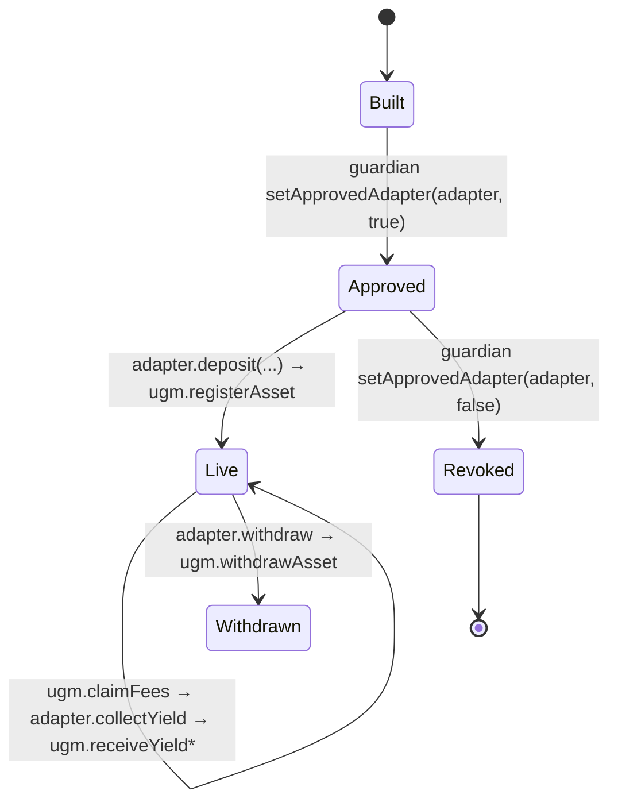
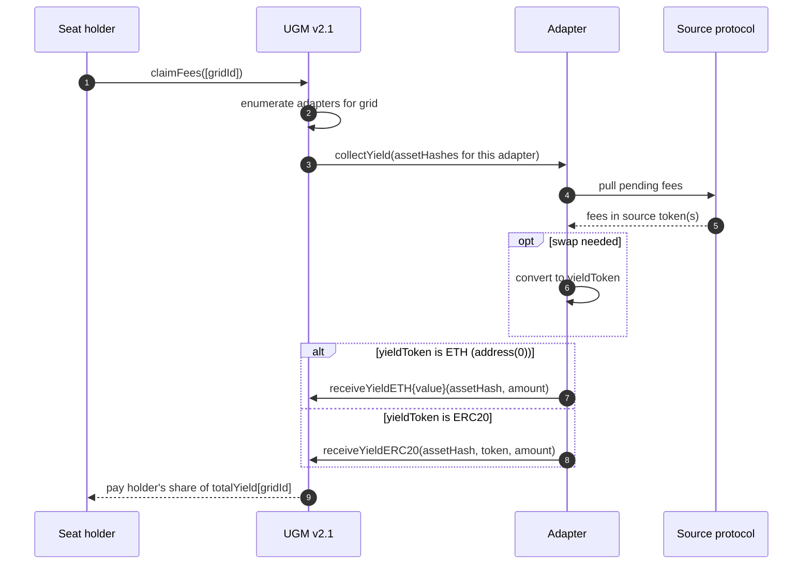

# 🔄 Adapter lifecycle

From "I have an unaudited contract on a fork" to "seat holders are claiming
yield from my source", an adapter goes through five phases.



## 1. Built

You write and audit the adapter. See [Building a yield adapter](building-an-adapter.md)
and [Submission checklist](../submit/checklist.md).

At this stage the adapter exists onchain but UGM doesn't trust it. Any call
to `ugm.registerAsset` from this address will revert with `NotApprovedAdapter`.

## 2. Approved

The Takeover guardian (multisig today) calls:

```solidity
ugm.setApprovedAdapter(adapter, true);
```

That single boolean flip is the trust gate. Once flipped, the adapter can
register assets onto **any** grid. There is no per-grid allowlist on the
adapter side — adapter approval is global.

See [Adapter approval process](../submit/adapter-approval-process.md) for how
to actually request that flip.

## 3. Live (per asset)

Each asset the adapter wants to attribute yield to gets registered:

```solidity
// Inside the adapter, called during deposit:
bytes32 assetHash = keccak256(abi.encodePacked(positionManager, tokenId));
ugm.registerAsset(gridId, assetHash);
```

A few invariants UGM enforces:

- **`assetHash` is globally unique.** Registering the same hash twice (even
  on different grids) reverts `AssetAlreadyRegistered`.
- **Only the registering adapter can withdraw or push yield.** UGM stores
  `assetAdapter[assetHash] = msg.sender` at registration time; anyone else
  calling `receiveYieldETH/ERC20` or `withdrawAsset` for that asset reverts
  `NotApprovedAdapter`.
- **Asset → grid is fixed at registration.** You can't move an asset from
  grid A to grid B; you have to withdraw and re-register.

After registration, the lifecycle steady state kicks in:



UGM batches all assetHashes belonging to one adapter into a single
`collectYield` call, so an adapter that handles N positions on a grid sees N
hashes in one call, not N separate calls.

## 4. Withdrawn (per asset)

When the adapter is done with an asset (creator wants their LP NFT back,
position closed, etc.), the adapter calls `ugm.withdrawAsset` to release the
slot:

```solidity
ugm.withdrawAsset(gridId, assetHash);
```

UGM clears `assetToGrid[assetHash]` and `assetAdapter[assetHash]`. Any future
yield pushed against that hash reverts.

In every reference adapter, `withdraw` is gated behind **the grid creator
owning all seats**:

```solidity
if (ugm.holderSeatCount(gridId, creator) != totalSeats) revert NotAllSeatsHeld();
```

That gate is intentional — yanking the yield source out from under live seat
holders would be theft. If your adapter has a different unwind story (e.g.
graduation, time lock), document it on its example page.

## 5. Revoked (adapter-wide)

If an adapter is compromised, retired, or replaced by a new version, the
guardian flips approval back off:

```solidity
ugm.setApprovedAdapter(adapter, false);
```

After revocation:

- The adapter **can no longer call `registerAsset`**. Existing assets stay
  registered.
- The adapter **can still call `receiveYieldETH/ERC20`** for assets it
  previously registered, because UGM checks `assetAdapter[assetHash]`, not
  `approvedAdapters[msg.sender]`, on the yield-receive path. This is so a
  revoked adapter can still wind down — push residual yield to UGM, then
  call `withdrawAsset` once seat conditions allow.
- `collectYield` will still be called by UGM whenever a holder claims; the
  adapter can choose to no-op or to keep pushing residual yield.

This soft-retirement model is why "redeploy + revoke old" is a clean upgrade
path. See `script/13_DeployAdapters.s.sol` in `takeover-contracts` for the
exact ordering used in deployments.

## Where to next

- [Building a yield adapter](building-an-adapter.md) — fill in the contract
  that lives between phases 1 and 3.
- [Submission checklist](../submit/checklist.md) — what to have ready before
  asking the guardian for phase 2.
