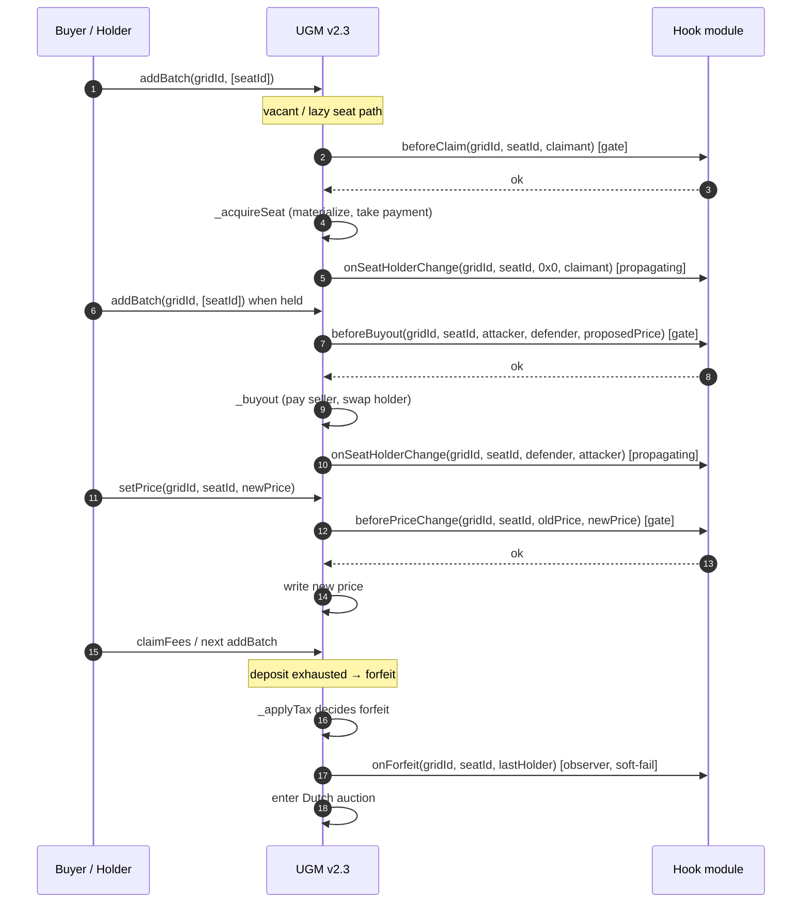

# Hook lifecycle and gas budgets

A hook module is a contract that implements
[`IGridHooksV23`](interface.md). UGM calls into it at well-defined seat
lifecycle points, inside a fixed gas budget, with revert behavior that
depends on whether the callback is a **gate** or an **observer**.

This page is the per-callback reference: where each one fires inside UGM,
what arguments it receives, what reverts cost, and how to budget gas.

## Dispatch sites

`moduleTransferSeat` doesn't fire a `beforeBuyout` (it's not a buyout).
It calls `onSeatHolderChange` after writing the new holder. See
[`moduleTransferSeat`](module-transfer-seat.md) for that path.

## Per-callback table

| Callback | Class | Fires from | Gas cap | Revert (with data) | Revert (empty data) |
|---|---|---|---|---|---|
| `onSeatHolderChange` | observer + propagating | `_acquireSeat`, `_buyout`, `_clearSeat`, `_reassignSeat`, `transferGridCreator`, `moduleTransferSeat` | 150,000 | propagates as `GovernanceCallFailed` (or module's data) | propagates as `GovernanceCallFailed` |
| `beforeClaim` | gate | `_acquireSeat` (vacant / lazy) | 150,000 | propagates module data | silent no-op (treats as v2.2-only module) |
| `beforeBuyout` | gate | `_buyout` | 150,000 | propagates module data | silent no-op |
| `beforePriceChange` | gate | `setPrice` | 150,000 | propagates module data | silent no-op |
| `onForfeit` | observer | `_applyTax` (tax-underwater forfeit only) | 150,000 | swallowed → `GovernanceHookSoftFail` | swallowed → `GovernanceHookSoftFail` |
| `yieldWeight` | view (`staticcall`) | reserved (not currently invoked) | 150,000 | swallowed → fallback to `1/totalSeats` | fallback to `1/totalSeats` |

`onSeatHolderChange` is the v2.2 hook. Reverts propagate because that's how
existing modules (notably `WhitelistGovernanceModule`) gate writes —
preserving the behavior keeps every v2.2 module compatible with v2.3 grids.

## Why the gate vs. observer split matters

**Gate callbacks** (`beforeClaim`, `beforeBuyout`, `beforePriceChange`) run
*before* UGM commits state. A revert leaves the world unchanged; UGM
bubbles the module's revert data so users see your revert reason in their
wallet.

**Observer callbacks** (`onForfeit`, `yieldWeight`) run after — or as part
of — a flow that has already decided to commit. A revert there cannot
cleanly roll the world back, so UGM swallows it and emits
`GovernanceHookSoftFail(gridId, module, selector)` so off-chain operators
can detect a buggy module without freezing seat ops.

`onSeatHolderChange` is the awkward case: it's an observer in spirit but
propagates reverts in practice for v2.2 backwards compatibility. New
modules should prefer the v2.3 gate callbacks for policy decisions and
treat `onSeatHolderChange` as informational.

## Empty revert data ≡ "didn't implement"

UGM v2.3 detects v2.2-era modules at runtime by checking the revert data
shape. When a v2.3-specific gate callback (`beforeClaim`, `beforeBuyout`,
`beforePriceChange`) returns no revert data inside the gas cap, UGM treats
that as "v2.2-only module: this callback wasn't implemented" and silently
proceeds.

This is what makes a single-line stub like
`function beforeClaim(uint256, uint256, address) external pure {}` work —
empty body, ABI-decoded to nothing, UGM short-circuits.

The implication: **never `revert()` with empty data** from a v2.3 hook.
Always include a custom error or message. Empty revert is reserved for
"not implemented".

## Gas budgeting

The 150,000 gas cap is generous for policy logic but tight for bookkeeping.
Practical guidance:

- **One SLOAD per gate is fine.** A whitelist check
  (`mapping → address`) typically lands at 2,500–4,000 gas with cold
  storage warming costs.
- **One SSTORE is borderline.** Cold SSTORE costs 22,100 gas; account for
  module-state updates carefully.
- **Don't iterate.** Loops over seats, holders, or any unbounded set are a
  recipe for a soft-fail under heavy grids. Hash to lookups instead.
- **External calls are dangerous.** If your module calls into another
  contract, account for the called contract's gas and the inner contract's
  state. UGM does not refund unused gas back to the caller.

A diagnostic pattern: emit your module's gas usage in a deploy-time
canary script, with a comment noting "must stay under 100k to leave headroom
for warm cache + UGM dispatch overhead".

## Module attach changes mid-flight

UGM re-checks the module attached to `gridGovernanceModule[gridId]` and the
guardian's `approvedGovernanceModules[module]` flag on every callback.
If a guardian revokes a module's approval between attach and call, UGM
silently no-ops the callback (no revert, no event) — that's by design, so
guardians get a kill switch without needing to brick a grid.

`moduleTransferSeat` adds a third gate (`approvedModules` and
`moduleDisabled`); see [pause-flags.md](pause-flags.md) for the truth
table.

## What to read next

- [The `IGridHooksV23` interface](interface.md) — exact signatures and
  semantics.
- [Registration and the two-stage allowlist](registration.md) — the
  guardian approval flow.
- [Two-axis pause + per-module disable](pause-flags.md) — when callbacks
  *don't* fire.
- [`moduleTransferSeat`](module-transfer-seat.md) — the v2.3 forced
  transfer path.
- [Examples: Whitelist](examples/whitelist-module.md) and
  [anti-snipe](examples/anti-snipe.md).
