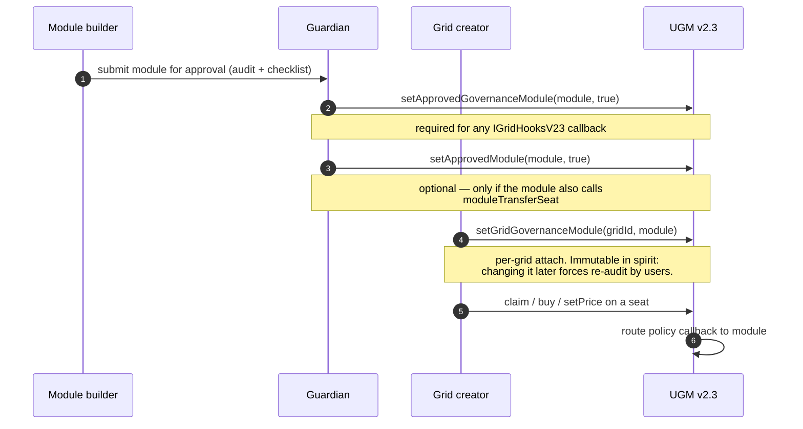

# Registration and the two-stage allowlist

A hook module is useful only if it's both **approved by the guardian** and
**attached to a grid by the creator**. UGM v2.3 splits that into two
allowlists so guardians can authorize a module to ship general policy
without unconditionally giving it the right to forcibly relocate seats.

## Three-step model

### Step 1 — `setApprovedGovernanceModule(module, true)`

This is the **base layer** allowlist for any module that wants to be
attached as a grid's hook target. Without this flag, calling
`setGridGovernanceModule(gridId, module)` reverts with
`NotApprovedGovernanceModule()`.

- Required for every callback in [`IGridHooksV23`](interface.md).
- Revoking it (`setApprovedGovernanceModule(module, false)`) silently
  disables future callbacks on every grid that already has the module
  attached. **It does not clear `gridGovernanceModule[gridId]`** — that
  preserves the indexer's view of the original attach so a revoke can be
  reversed without re-attaching on every grid.

### Step 2 — `setApprovedModule(module, true)` (optional)

Strict subset of step 1. Only required if the module wants to call
`moduleTransferSeat` (v2.3-only forced-transfer path).

- A module on `approvedModules` MUST also be on `approvedGovernanceModules`
  (UGM doesn't check directly, but `moduleTransferSeat` requires the
  module to *also* be the grid's attached governance module — and that
  attach already gates on `approvedGovernanceModules`).
- Revoking just this flag silently disables `moduleTransferSeat` calls
  while leaving the rest of the hook flow untouched. Useful if a module
  starts misbehaving on the forced-transfer path but its general gating
  is still trustworthy.
- Emits `ApprovedModuleUpdated(module, approved)` on every flip.

### Step 3 — `setGridGovernanceModule(gridId, module)`

The grid creator picks which approved module attaches to their grid.

- Caller must be `_grids[gridId].creator`.
- Module must already be on `approvedGovernanceModules`.
- Passing `address(0)` detaches.
- Emits `GridGovernanceModuleSet(gridId, module)` on every change.

A grid creator can switch modules at any time. Practical advice: **don't**.
Existing seat holders bought into a specific policy; replacing the module
mid-grid is a trust violation that an indexer-driven UI should flag
prominently.

## The "soft revoke" guarantee

UGM v2.3 deliberately does not let the guardian remove a hook from a grid.
The kill switches are layered, not nuclear:

| What guardian flips | What it disables | What it preserves |
|---|---|---|
| `setApprovedGovernanceModule(m, false)` | all `IGridHooksV23` callbacks for `m` | `gridGovernanceModule[gridId] == m` (so reapproval restores callbacks) |
| `setApprovedModule(m, false)` | `moduleTransferSeat` calls from `m` | governance hook callbacks for `m` |
| `setModuleDisabled(m, true)` | `moduleTransferSeat` calls from `m` (soft) | both allowlist entries |
| `pauseGridModules(gridId)` | `moduleTransferSeat` on **this grid** | other grids the module is attached to |

For the truth table covering all four, see
[Two-axis pause + per-module disable](pause-flags.md).

## How to get approved

The guardian approval flow is documented per-module-type:

- **Yield adapters:** [submit/adapter-approval-process.md](../submit/adapter-approval-process.md).
- **Hook modules:** same process today (DM the team with the audit + the
  machine-readable checklist). The submit pipeline accepts both — adapters
  and hook modules — under the same checklist schema (`hook.*` and
  `contract.*` categories).

The pre-submission checklist for hook modules is the YAML in
[submit/checklist.yml](../submit/checklist.yml). Run it against your
contract before opening the conversation; the team will run it again before
calling `setApprovedGovernanceModule`.

## Indexing module changes

Off-chain consumers should watch:

- `GridGovernanceModuleSet(gridId, module)` — attach / detach.
- `ApprovedModuleUpdated(module, approved)` — guardian flips on the
  `approvedModules` (transfer-authorised) list.
- `ModuleDisabledEvent(module, disabled)` — guardian's soft kill switch on
  the same list.
- `GridModulesPausedEvent(gridId, paused)` — per-grid module pause.

There is no event for `setApprovedGovernanceModule` (intentional — that
list is older than the v2.3 module overhaul). Indexers that need to
display "module approved on this grid" should reconstruct from
`GridGovernanceModuleSet` + a guardian-state RPC read.

## What to read next

- [Two-axis pause + per-module disable](pause-flags.md) — full kill-switch
  semantics.
- [`moduleTransferSeat`](module-transfer-seat.md) — when step 2 matters.
- [submit/checklist.md](../submit/checklist.md) — submission pipeline.
