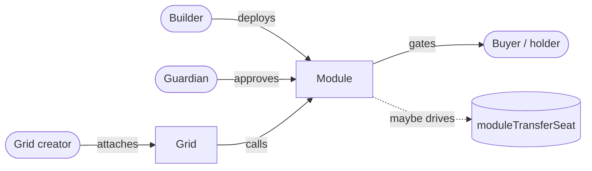

# The hook model

UGM v2.3 introduces **hook modules** — contracts that gate or observe
seat economics on a per-grid basis. A grid creator picks one approved
module and attaches it; UGM calls into it at five lifecycle points
inside a fixed gas budget. Use them to ship policy (whitelist, anti-
snipe, KYC gates), drive forced transfers (game conquest, DAO seat
rotation, prediction market resolution), or build economic layers that
sit on top of Takeover's marketplace.

This page is the **mental model**. The mechanical pages — interface,
lifecycle, registration, pause flags, forced transfers — live under
[Hook modules](../hooks/interface.md).

## What a hook module is

A hook module is a Solidity contract that:

- Implements [`IGridHooksV23`](../hooks/interface.md) (or its v2.2
  predecessor `IGridGovernanceHooks` — UGM v2.3 accepts both).
- Has been approved by the protocol guardian via
  `setApprovedGovernanceModule(module, true)`.
- Is attached to a specific grid by the grid creator via
  `setGridGovernanceModule(gridId, module)`.

Once attached, UGM routes every state-changing seat event through the
module before committing — your module gets to decide whether the
event is allowed.

## The two halves: gate vs. observer

Hook callbacks split into two classes:

**Gate callbacks** run *before* UGM commits state. A revert leaves the
world unchanged; the user sees your revert reason in their wallet.

- `beforeClaim(gridId, seatId, claimant)` — fires before first-time
  acquisition of a vacant / lazy seat.
- `beforeBuyout(gridId, seatId, attacker, defender, proposedPrice)` —
  fires before a held seat is bought out.
- `beforePriceChange(gridId, seatId, oldPrice, newPrice)` — fires
  before `setPrice`.

**Observer callbacks** run *after* — or as part of — a flow that's
already committed. UGM swallows their reverts and emits
`GovernanceHookSoftFail(gridId, module, selector)` so a buggy module
can't brick the path.

- `onSeatHolderChange(gridId, seatId, oldHolder, newHolder)` — fires
  on every materialized holder change. **Exception:** this v2.2
  holdover propagates reverts for backward compatibility with
  `WhitelistGovernanceModule`.
- `onForfeit(gridId, seatId, lastHolder)` — fires on tax-underwater
  forfeit + Dutch entry.
- `yieldWeight(gridId, seatId) view returns (uint256)` — reserved for
  future per-seat yield weighting; v2.3 doesn't consume it yet.

## What hooks can and cannot do

**Hooks gate behavior, they don't drive it.** Use a hook to say "this
buy is allowed" or "this price change is forbidden". Don't use a hook
to perform unrelated work — every callback runs inside a 150,000 gas
budget, and any storage write you do inside the gate counts against
that budget.

**For driving seat changes**, use the dedicated entrypoint:
[`moduleTransferSeat`](../hooks/module-transfer-seat.md). That's where
you forcibly relocate a seat (military conquest, DAO ousting, scripted
rotation) without going through the buyout payment flow.

**Forfeiture is observer-only.** By the time `_applyTax` decides to
forfeit a seat, the deposit is already exhausted; reverting from
`onForfeit` would leave the seat in an invalid state. Modules wanting
to gate forfeits should use `beforePriceChange` / `beforeBuyout`
instead — those fire before economic damage occurs.

**No phantom buyouts.** UGM exposes `Deposit` and `None` refund modes
on `moduleTransferSeat`. Paying the prior holder their self-assessed
price is, by definition, an economic takeover and should route through
`addBatch` so the standard splits / hooks / events fire.

## How modules and grids relate

Note three independent permission layers:

1. **Guardian approval** — `setApprovedGovernanceModule(module, true)`
   lets any creator attach the module.
2. **Creator attach** — `setGridGovernanceModule(gridId, module)`
   binds a specific grid to a specific module. One module instance can
   safely serve many grids if it's keyed by `(gridId, seatId)`.
3. **Optional transfer authorisation** —
   `setApprovedModule(module, true)` is a strict subset of (1) and is
   only required for `moduleTransferSeat`. Most modules don't need this.

## Compatibility with v2.2 modules

A module that only implements the v2.2 surface (just
`onSeatHolderChange`) deploys onto a v2.3 grid without modification.
UGM v2.3's safety harness:

- Calls every additional v2.3 callback inside a `try { … } catch`.
- Treats "function-selector-not-found" as "didn't implement; treat as
  no-op".
- Bubbles real reverts (with non-empty data) so modules can return
  readable revert reasons.

This is what makes `WhitelistGovernanceModuleV2` ship on both v2.2 and
v2.3 grids without redeploy — UGM's runtime selector check absorbs
the missing v2.3 callbacks. See [hooks/lifecycle.md](../hooks/lifecycle.md)
for the exact dispatch semantics.

## Where to next

- [The IGridHooksV23 interface](../hooks/interface.md) — exact
  signatures and semantics.
- [Hook lifecycle and gas budgets](../hooks/lifecycle.md) — dispatch
  sites and per-callback gas analysis.
- [Registration and the two-stage allowlist](../hooks/registration.md)
  — how a module gets approved and attached.
- [Two-axis pause + per-module disable](../hooks/pause-flags.md) —
  guardian kill switches.
- [`moduleTransferSeat`](../hooks/module-transfer-seat.md) — forced
  reassignment.
- [Skill: build a hook module](../skills/build-hook-module.md) — the
  agent-friendly walkthrough.
