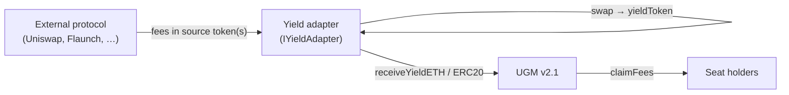
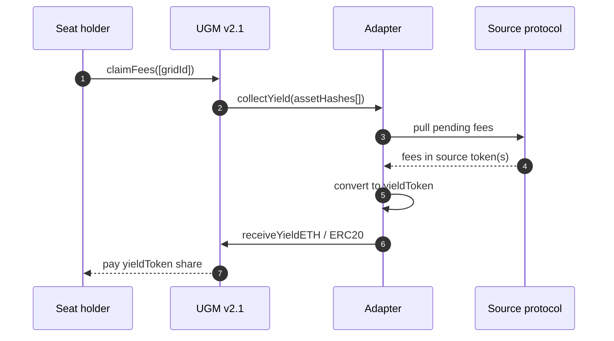

# The yield adapter model

UGM v2.1 doesn't know anything about Uniswap, Flaunch, or any other yield
source. It only knows about three things:

1. **Grids** — seat ledgers with a configured `yieldToken` (ETH or one ERC20).
2. **Assets** — opaque `bytes32` identifiers registered to a grid. UGM doesn't
   care what an asset is; it only cares that some adapter is responsible for
   it.
3. **Yield deposits** — a balance of `yieldToken` per grid that seat holders
   can claim against.

Adapters bridge the gap. An adapter is a contract that:

- **Holds** whatever object represents the yield source on the source side
  (an LP NFT, a Flaunch fee escrow position, the right to call
  `withdrawProtocolFees`, etc.).
- **Knows how to collect** pending yield from that source.
- **Knows how to convert** the collected fees into the grid's `yieldToken`
  (ETH/WETH/flETH or a specific ERC20).
- **Pushes** the converted yield into UGM via `receiveYieldETH` /
  `receiveYieldERC20`.

## Push, with one pull trigger

Yield deposits are **push**: only the adapter ever increments
`totalYield[gridId]`. Seat holders never call the source protocol directly.

To make sure the latest yield is reflected the moment a holder claims, UGM
**pulls** the adapter once per `claimFees` call:

That one round-trip is the entire push/pull contract:

- UGM trusts the adapter to be **idempotent** — calling `collectYield` twice
  in a row with no new source-side activity must be a no-op.
- The adapter trusts UGM to **only call `collectYield` from a guarded path**
  (UGM holds a reentrancy lock; the adapter must accept being called inside
  that lock).

## Why an adapter, not a hook on UGM

UGM v2.1 is **immutable**. There is no upgrade lever, no plugin slot for new
yield sources. The only extension surface is the adapter registry: the
guardian whitelists an adapter address (`setApprovedAdapter`), the adapter
calls `registerAsset(gridId, assetHash)` to claim an asset on a grid, and from
that point on UGM treats the adapter as the authority for that asset.

This pushes responsibility onto the adapter:

- **Yield correctness** is the adapter's problem. UGM only ever sees the
  amount the adapter forwards.
- **Source-side ownership** is the adapter's problem. UGM never holds an LP
  NFT, never owns a fee-escrow position.
- **Conversion to `yieldToken`** is the adapter's problem. UGM only accepts
  `yieldToken` (or, if the grid is ETH-yield, raw ETH or flETH/WETH).

That tradeoff is deliberate: it keeps UGM small and immutable while letting
new yield sources land without touching the protocol core.

## What you don't have to think about

- **Tax accounting.** Tax is paid by seat holders in the grid's `taxToken`;
  it never touches the adapter.
- **Buyouts.** Seat sales settle inside UGM and route to the grid's sale
  receiver; not the adapter's concern.
- **Per-seat accounting.** UGM splits `totalYield[gridId]` across seats
  itself; the adapter just deposits in bulk against an `assetHash`.
- **Multi-grid bookkeeping.** One adapter can serve many grids; UGM keys
  every deposit by `assetHash`, which maps to a single `gridId`.

## Where to next

- [The IYieldAdapter interface](../adapters/interface.md) — exactly two
  functions; here's the spec.
- [Adapter lifecycle](../adapters/lifecycle.md) — from `setApprovedAdapter`
  to `withdrawAsset`.
- [Building a yield adapter](../adapters/building-an-adapter.md) — the
  step-by-step.
